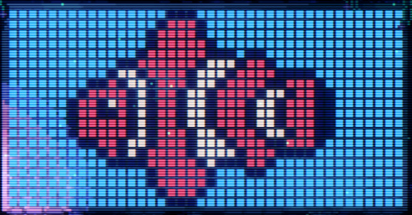
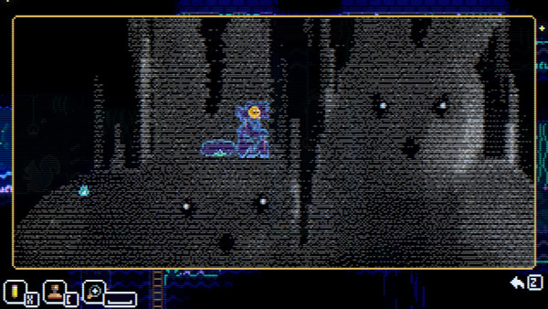

Python-Based CLI Animal Well Savegame Editor
============================================

`animalwellsave` is a save editor (and data backend) for editing
[Animal Well](https://store.steampowered.com/app/813230/ANIMAL_WELL/) savegames.
It supports editing nearly everything stored in the savegames.  In addition
to the editing features you'd expect, it's got some features you might not
expect, including:

 - Importing/Exporting specific slots
 - Setting the Bunny Mural to its default, solved, or cleared state, and
   importing/exporting the mural in raw or image formats
 - Image import/export of the "pencil" map layer
 - Forcing Kangaroo spawns to a specific room
 - Respawning consumables (fruit, firecrackers) on the map
 - Clearing ghosts / Lighting Candles
 - Clearing out "illegal" pink-button presses and bunnny collection (acquired
   via cheating or glitching) to avoid future savefile corruption or BDTP
   puzzle problems
 - And much more!  Read on for the full details

Table of Contents
-----------------

 - [Overview](#overview)
 - [Running / Installation](#running--installation)
   - [Easiest Method: pip](#easiest-method-pip)
   - [Git Checkout (the proper way)](#git-checkout-the-proper-way)
   - [Git Checkout (the lazy way)](#git-checkout-the-lazy-way)
   - [Release Archives (not recommended)](#release-archives-not-recommended)
 - [TODO](#todo)
 - [Usage](#usage)
   - [Showing Save Info](#showing-save-info)
   - [Checksum](#checksum)
   - [Choose Slot](#choose-slot)
   - [Import/Export Slots](#importexport-slots)
   - [Frame Seed](#frame-seed)
   - [Global Unlocks (Figurines, etc)](#global-unlocks-figurines-etc)
   - [Health](#health)
   - [Spawnpoint](#spawnpoint)
   - [Steps](#steps)
   - [Deaths](#deaths)
   - [Bubbles Popped](#bubbles-popped)
   - [Berries Eaten While Full](#berries-eaten-while-full)
   - [Game Ticks (Elapsed Time)](#game-ticks-elapsed-time)
   - [Wings (Flight)](#wings-flight)
   - [Firecrackers](#firecrackers)
   - [Keys / Matches](#keys--matches)
   - [Nuts](#nuts)
   - [Equipment](#equipment)
   - [Inventory](#inventory)
   - [Map Unlocks](#map-unlocks)
   - [B.B. Wand](#bb-wand)
   - [Egg 65](#egg-65)
   - [Cheater's Ring](#cheaters-ring)
   - [Progress/Quests](#progressquests)
   - [Mock Disc Location](#mock-disc-location)
   - [Caged Cats](#caged-cats)
   - [Kangaroo Room](#kangaroo-room)
   - [K. Shards](#k-shards)
   - [S. Medal and E. Medal](#s-medal-and-e-medal)
   - [Animal Head Teleporters](#animal-head-teleporters)
   - [Bunny Mural](#bunny-mural)
     - [Mural Import/Export](#mural-importexport)
   - [Flames](#flames)
   - [Manticores](#manticores)
   - [Teleportation Torus](#teleportation-torus)
   - [Bosses](#bosses)
   - [Eggs](#eggs)
   - [Bunnies](#bunnies)
     - [Illegal Bunnies](#illegal-bunnies)
   - [Respawn Consumables](#respawn-consumables)
   - [Ghosts](#ghosts)
   - [Squirrels](#squirrels)
   - [Buttons](#buttons)
   - [Doors / Walls](#doors--walls)
   - [Chests](#chests)
   - [Candles](#candles)
   - [Crank Puzzles](#crank-puzzles)
   - [Water Reservoirs](#water-reservoirs)
   - [Detonators](#detonators)
   - [Destroyed Tiles](#destroyed-tiles)
   - [Big Stalactites](#big-stalactites)
   - [Stalactites / Stalagmites / Icicles](#stalactites--stalagmites--icicles)
   - [Minimap](#minimap)
   - [Map Marks](#map-marks)
   - [Pencil Images](#pencil-images)
 - [Library](#library)
 - [Changelog](#changelog)
 - [License](#license)

Overview
--------

Make sure to backup your saves before using this!  I've yet to encounter any
savefile corruption, but it's always possible you could run into a weird
edge case.

Work on decoding the savegame structure has mostly been done by
[Kein](https://github.com/Kein/), [just-ero](https://github.com/just-ero),
lipsum, polinet68, avengah, and myself.  My own contributions were mostly
at the beginning of the process; Kein, just-ero, and lipsum have been
responsible for the majority of the save format at this point.  Many thanks
to them for filling things out!

A complete mapping of the savegame data can be found at
[Kein's awsgtools repo](https://github.com/Kein/awsgtools).  At time of
writing the primary format there is an
[010 Editor](https://www.sweetscape.com/010editor/) binary template
plus an [ImHex](https://imhex.werwolv.net/) pattern.  Other translations
may become available over time.  A human-readable document describing the
save format can be found [at the wiki of that repo](https://github.com/Kein/awsgtools/wiki)
as well, though that document might lag behind the official templates.

Running / Installation
----------------------

This is a Python-based CLI app and library.  It should run on Python 3.10+,
though it's received most of its testing on Python 3.12.  There is currently
no GUI component -- you'll have to be comfortable working in the commandline
for this to work.

### Easiest Method: pip

At the basic level, once Python is installed, you can install `animalwellsave`
with a simple:

    pip install animalwellsave

To also pull in the dependencies necessary to support importing/exporting
images into the "pencil" minimap layer and bunny mural, you can alternately
specify this for the installation line:

    pip install animalwellsave[Images]

You could also install it for just your user with:

    pip install --user animalwellsave[Images]

Once installed, there will be an `awsave` command available to run, like so:

    awsave --help

Rather than doing a "global" installation as mentioned above, it's recommended
to install in a [virtual environment](https://docs.python.org/3/library/venv.html),
though.  (This is true of Python apps in general.)  On Unix/Mac:

    cd /wherever/you/want/to/keep/the/virtualenv
    python -m venv virtualenv_dir
    source virtualenv_dir/bin/activate
    pip install animalwellsave[Images]

Or on Windows:

    cd \wherever\you\want\to\keep\the\virtualenv
    python -m venv virtualenv_dir
    virtualenv_dir\Scripts\activate
    pip install animalwellsave[Images]

### Git Checkout (the proper way)

The app can also be run right from a git checkout.  The "correct" way to 
do this is with a virtual environment using
["editable" mode](https://setuptools.pypa.io/en/latest/userguide/development_mode.html).
From the main project checkout dir (example here is for Unix/MacOS; the
activation line is different for Windows -- see above):

    python -m venv .venv
    source .venv/bin/activate
    pip install --editable .

Optionally, to install the dependencies needed for importing/exporting images
to the "pencil" minimap layer and bunny mural, you can run:

    pip install -r image-requirements.txt

Once done, you should be able to run the `awsave` command as usual:

    awsave --help

### Git Checkout (the lazy way)

Alternatively, if you want to run it directly from a git checkout *without*
setting up a virtual environment and setting it to editable mode, you can
just use the shortcut `awsave.py` script right in the main dir:

    ./awsave.py --help

Or, you can call the cli module directly:

    python -m animalwellsave.cli --help

### Release Archives (not recommended)

Bundled with official releases on the
[Github Releases Page](https://github.com/apocalyptech/animalwellsave/releases)
are Python-produced "source distribution" and "built distribution" (wheel)
files (these are also available via
[animalwellsave's pypi area](https://pypi.org/project/animalwellsave/#files)).
Neither of these are meant to be complete archives of the github repo, and will
be missing content like the "convenience" `awsave.py` script that's in the gitub
repo root.  These files *can* be installed via pip, though, using the various
methods described above:

    pip install animalwellsave-1.1.0.tar.gz
    pip install animalwellsave-1.1.0-py3-none-any.whl

In general there's probably not much reason to manually download/install these
files; if you don't want to use `pip` to install the app, just checking out
the git repo is probably the better method.  Still, if you wanted to install via
pip but not use its automatic project download features, you're welcome to
install via that method if you want.  After install, the `awsave` command should
be available for use.

TODO
----

The editor currently does not attempt to support *everything* inside the
savegames.  Some notable bits of data which can't be edited directly (but
which are present in the data library):

 - General Crank status
 - Elevator status

Some data is, likewise, not actually even present in the data library
yet:

 - Some seemingly-unimportant flags have been omitted from a few areas,
   for instance the global "switch" state (left/right), early-game flags
   like "woke up," etc.
 - Achievements *(unsure if setting these in the save would actually make
   them activate on Steam)*
 - Game Options

While I don't have any current plans to support the above, there are a
few other things which would be nice eventually:

 - Mapping chests to their unlocks, so unlocking eggs (for instance) would
   mark the relevant chests as opened.  Vice-versa for disabling unlocks;
   it'd be nice to close the associated chest so it could be re-acquired.
   At the moment, chest opening/closing is all-or-nothing.
 - Similarly, mapping buttons/reservoirs to which doors they open would be
   nice, to be able to couple those a bit more closely.  At the moment,
   button/door states are all-or-nothing.
 - Ability to perform slot actions on an exported slot file?
 - Once [Kaitai Struct](https://kaitai.io/)'s
   [serialization features](https://doc.kaitai.io/serialization.html)
   make it into an official release, it'd be nice to convert over to that.
   Something like that is really what I'd wanted to do at the start, rather
   than my own janky weirdness.
 - Clean up CLI options to be more consistent with pluralizations, noun-verb
   ordering, abbreviations, etc.  Even I often screw up the CLI options
   occasionally and need to look at the `--help` output.  I'll probably wait
   for a Kaitai Struct rewrite to do so, though (which would likely be a 2.0
   release)

Usage
-----

Here is a detailed list of all the arguments available on the CLI editor.
Note that these arguments can be chained together pretty much as long as
you want.  For instance:

    awsave AnimalWell.sav -i -s 0 --equip-enable all --inventory-enable pack --firecrackers 6 --upgrade-wand

### Showing Save Info

To show information about the save, including for any chosen slots, use
`-i`/`--info`:

    awsave AnimalWell.sav -i
    awsave AnimalWell.sav --info

The base info output will only show the "global" information which applies to
all slots.  To show information on a specific slot, use the `-s`/`--slot`
argument (described in more detail below):

    awsave AnimalWell.sav -i -s 1
    awsave AnimalWell.sav --info --slot 1

By default, the info output will just show you things that you *have* collected
or done throughout the game.  To also show information about things you *haven't*
collected or done (such as missing eggs, etc), use `-v`/`--verbose`:

    awsave AnimalWell.sav -i -s 1 -v
    awsave AnimalWell.sav --info --slot 1 --verbose

Additionally, the in-save data offsets for every bit of data that the data
library knows about can be printed with `-d`/`--debug`.  This will show the
info for all slots as well, regardless of which slots have been chosen to show.
It will write this information to stderr:

    awsave AnimalWell.sav -d
    awsave AnimalWell.sav --debug

Finally, by default the info dump will use column outputs when showing long lists,
such as unlocked eggs.  To have the utility only output one item per line, use
the `-1`/`--single-column` argument:

    awsave AnimalWell.sav -i -s 1 -1
    awsave AnimalWell.sav --info --slot 1 --single-column

### Checksum

The `--fix-checksum` option can be used to fix the savegame's checksum without
changing anything else.  (The utility will automatically update the checksum if
any other changes are made to the file.)  If the save has an invalid checksum,
Animal Well will spawn a Manticore friend to follow you around, so this can be
used to fix it in case any manual hex editing has been going on.

    awsave AnimalWell.sav --fix-checksum

If you wanted to *intentionally* force an invalid checksum, because you'd like
a Manticore friend to go exploring with, you can use the `--invalid-checksum`
argument.  If that's the *only* save-edit you want to do, you'll have to specify
the `--fix-checksum` argument as well:

    awsave AnimalWell.sav --fix-checksum --invalid-checksum

### Choose Slot

Most options in the editor operate on slot data, so this argument is generally
necessary.  `-s` or `--slot` can be used for this, to choose
a specific slot (`1`, `2`, or `3`), or to operate on *all* slots by
choosing `0`.

    awsave AnimalWell.sav -i -s 1
    awsave AnimalWell.sav --info --slot 2

Note that a few arguments (namely the various import/export arguments for slot
data, pencil minimap images, and bunny murals) do not allow using `0` to
specify "all slots."

### Import/Export Slots

Slot data can be imported or exported to allow transferring slots without
also transferring "global" data (like collected figurines, or game options).
For example, to export slot 2 into the file `slot2.dat` with the
`--export`/`--export-slot` option:

    awsave AnimalWell.sav -s 2 --export slot2.dat

Then that file could be imported into another slot with the `--import`/`--import-slot`
option:

    awsave AnimalWell.sav -s 3 --import slot2.dat

Note that the only data checking the import process does is to ensure that
the file being imported is exactly the right filesize (149,760 bytes).

If the filename you attempt to export to already exists, this app will
prompt you if you want to overwrite.  To force overwriting without any
interactive prompt, use the `-f`/`--force` option:

    awsave AnimalWell.sav -s 2 --export slot2.dat -f

### Frame Seed

The "frame seed" is presumably used for various randomizations in the
game, but the most noticeable effect is to determine which Bunny Mural
segment is presented to the user.  The mural segment shown is the frame
seed modulo 50, so you could theoretically get all of the segments
yourself by editing this value 50 times.  `--frame-seed` can be used
to alter the value:

    awsave AnimalWell.sav --frame-seed 42

### Global Unlocks (Figurines, etc)

Some items unlocked in the game apply to all slots, such as the stopwatch,
pedometer, pink phones, and the various figurines which show up in the House.
The `--globals-enable` and `--globals-disable` arguments can be used to
toggle the various states.  The special value `all` can be used to toggle
all of them at once, and the argument can be specified multiple times.

    awsave AnimalWell.sav --globals-disable stopwatch --globals-disable pedometer
    awsave AnimalWell.sav --globals-enable all

Valid values are: `stopwatch`, `pedometer`, `pink_phone`, `souvenir_cup`,
`origami`, `two_rabbits`, `owl`, `cat`, `fish`, `donkey`, `deco_rabbit`,
`mama_cha`, `giraffe`, `incense`, `peacock`, `otter`, `duck`,
`pedometer_unicode`, `all`.

### Health

Player health can be set with the `--health` option.  Note that this is the
total number of hearts, which includes your base health, any gold hearts,
and any "extra" blue hearts.  The game's maximum is probably 12, though I
haven't actually tested beyond that.

    awsave AnimalWell.sav -s 1 --health 8

Relatedly, gold hearts can be added with the `--gold-hearts` option:

    awsave AnimalWell.sav -s 1 --health 12 --gold-hearts 4

### Spawnpoint

The player's spawnpoint is stored in the game by room coordinates, and can
be set with the `--spawn` argument.  The upper-left room is at coordinate
2,4.  If there is a phone in the room that has been specified, the player
will spawn near the phone.  Otherwise, the player spawns in the upper-left-most
available spot in the room.

    awsave AnimalWell.sav -s 1 --spawn 11,11

### Steps

You can set the number of steps the player has walked with the `--steps`
argument:

    awsave AnimalWell.sav -s 1 --steps 42

The ingame pedometer rolls over to 0 after hitting 99,999.

### Deaths

You can set the number of recorded deaths using the `--deaths` option:

    awsave AnimalWell.sav -s 1 --deaths 0

### Saves

You can set the number of saves that the player has performed using the
`--saves` option.  Note that the minimum legal value here is 1, since
the slot data will not be populated on-disk until the first savegame.

    awsave AnimalWell.sav -s 1 --saves 1

### Bubbles Popped

The number of your B.Wand bubbles which have been popped by hummingbirds
can be altered with the `--bubbles-popped` argument:

    awsave AnimalWell.sav -s 1 --bubbles-popped 42

### Berries Eaten While Full

The number of berries you've eaten while at full health can be altered
with the `--berries-eaten-while-full` argument:

    awsave AnimalWell.sav -s 1 --berries-eaten-while-full 10

### Game Ticks (Elapsed Time)

The game keeps track of how many "ticks" have elapsed since the beginning
of the game.  The game runs at 60fps, so this value is *not* actually in
milliseconds.  There are technically two fields for this: one value which
is *just* ingame time (which does not seem to be used anywhere), and
another which includes all the time spent in "pause" menus.  There are
two arguments related to ticks.  First, `--ticks-copy-ingame` can be
used to copy your "ingame" counter over to the "including paused" counter,
in case you feel that your speedrun effort is being unfairly held back by
pausing:

    awsave AnimalWell.sav -s 1 --ticks-copy-ingame

Alternatively, you can just set the numeric value for both at the same
time using `--ticks`:

    awsave AnimalWell.sav -s 1 --ticks 0

### Wings (Flight)

A very late-game unlock gives you the ability to sprout wings and fly
around very quickly, by double-jumping.  This can be enabled or disabled
using `--wings-enable` and `--wings-disable`:

    awsave AnimalWell.sav -s 1 --wings-enable
    awsave AnimalWell.sav -s 1 --wings-disable

### Firecrackers

Your player firecracker count can be set with the `--firecrackers` argument.
Setting this to a value greater than zero will also unlock the Firecracker
equipment, if it's not already unlocked.

    awsave AnimalWell.sav -s 1 --firecrackers 3

### Keys / Matches

Keys and Matches can be set using the `--keys` and `--matches` arguments.
Note that the keys here are the "generic" ones which show up on the left in your
inventory.  The maximum numbers available in the vanilla game are 6 keys, and
9 matches.

    awsave AnimalWell.sav -s 1 --keys 6 --matches 9

### Nuts

The number of nuts that you've stolen from squirrels cna be set with the `--nuts`
argument.  Note that the game doesn't actually report this count to the user in
any way.

    awsave AnimalWell.sav -s 1 --nuts 4

### Equipment

Equipment is the various items you directly use throughout the game, like
Firecrackers, B. Wand, Disc, etc.  These can be individually toggled on or off
using the `--equip-enable` and `--equip-disable` arguments.  Those can be specified
more than once, and you can also use `all` as a special option to process all at
once.

    awsave AnimalWell.sav -s 1 --equip-enable all
    awsave AnimalWell.sav -s 1 --equip-disable disc --equip-disable yoyo

Valid values are: `firecracker`, `flute`, `lantern`, `top`, `disc`, `wand`,
`yoyo`, `slink`, `remote`, `ball`, `wheel`, `uvlight`, `all`.

Note that whenever you toggle the Disc state using this option, this utility will
by default attempt to set the game's quest states appropriately, to avoid having
you get chased by a ghost dog.  This can end up changing where the Mock Disc is
in the gameworld.  When giving yourself the Disc, there are two valid game states:
one with the Mock Disc in the initial dog head statue, and the other with the
Mock Disc in the M. Disc Shrine.  By default, the quest-correction will set the
game to the dog-head-statue state, but you can have it put the Mock Disc in the
shrine instead with `--prefer-disc-shrine-state`:

    awsave AnimalWell.sav -s 1 --equip-enable disc --prefer-disc-shrine-state

Alternatively, you can disable the auto-fix attempt entirely using the
`--dont-fix-disc-state` argument, in case you want to have a doggo friend to
keep you company (or if you're editing the quest states yourself later):

    awsave AnimalWell.sav -s 1 --equip-enable disc --dont-fix-disc-state

### Inventory

Inventory refers to other items which you acquire throughout the game which are
*not* usable equipment items.  These can be individually toggled on or off
using the `--inventory-enable` and `--inventory-disable` arguments.  These can
be specified more than once, and you can also use `all` as a special option to
process all at once.

    awsave AnimalWell.sav -s 1 --inventory-enable all
    awsave AnimalWell.sav -s 1 --inventory-disable house_key --inventory-disable office_key

Valid values are: `mock_disc`, `s_medal`, `house_key`, `office_key`, `e_medal`,
`pack`, `all`.

Note that if you add the Mock Disc using this option, this utility will by default
attempt to set the game's quest state appropriately as if you'd picked up the Mock Disc
ingame.  You can disable this behavior with the `--dont-fix-disc-state` argument:

    awsave AnimalWell.sav -s 1 --inventory-enable mock_disc --dont-fix-disc-state

Relatedly, if you add all equipment *and* all inventory using the following options:

    awsave AnimalWell.sav -s 1 --equip-enable all --inventory-enable all

... the utility will by default exclude the Mock Disc from the inventory unlocks, since
that's not actually a valid gamestate in a savegame.  As with the other Disc / Mock
Disc options, you can force both in your inventory at the same time by specifying
`--dont-fix-disc-state`.

### Map Unlocks

The various map-feature unlocks can be enabled using the `--map-enable` argument.
The special value `all` can be used to unlock all three at once:

    awsave AnimalWell.sav -s 1 --map-enable all

Valid values are: `unlock_map`, `unlock_stamps`, `unlock_pencil`, `all`.

### B.B. Wand

The B. Wand can be upgraded to the B.B. Wand (or downgraded back) using
`--upgrade-wand` and `--downgrade-wand`:

    awsave AnimalWell.sav -s 1 --upgrade-wand
    awsave AnimalWell.sav -s 1 --downgrade-wand

### Egg 65

Egg 65 can be enabled or disabled in your inventory using `--egg65-enable` and
`--eg65-disable`:

    awsave AnimalWell.sav -s 1 --egg65-enable
    awsave AnimalWell.sav -s 1 --egg65-disable

### Cheater's Ring

The Cheater's Ring can be enabled or disabled in your inventory using
`--cring-enable` and `--cring-disable`:

    awsave AnimalWell.sav -s 1 --cring-enable
    awsave AnimalWell.sav -s 1 --cring-disable

### Progress/Quests

There are two fields in the savegame which relate to progress / quests.
I honestly wasn't sure what to call the first one -- it includes some very
early-game flags like "game started" and "ready to hatch," but then also
includes a very late-game flag when the House Key drops after defeating the
first Manticore.  The field is totally separate from the main "quest" area.
So, I settled on "progress." Apart from the House Key drop, the only other flag
the editor supports is the one that enables your HP Bar to be shown on the
screen.  The arguments to edit this field are `--progress-enable` and
`--progress-disable`.  The special value `all` can be used to process all
(well, both) at once:

    awsave AnimalWell.sav -s 1 --progress-enable all
    awsave AnimalWell.sav -s 1 --progress-disable hp_bar

Valid values are: `hp_bar`, `house_key`, `all`.

The *main* field which defines progress/quest information is rather more
complete, but note that it's not really recommended to alter this structure
directly.  Some of the states in here rely on other states and other bit of data
to be a "valid" gamestate (or at least, one which could be encountered in an
unmodified game).  Specific arguments exist for managing all quest state flags
supported by the editor, and should take care of any weird edge cases for you.
Still, if you want to tweak any of these by hand, they're available here.  Manual
tweaking will be performed at the very *end* of the slot processing, so you can
use this argument to override any other massaging that previous processing might
have done.

The main quest state bitfield can be altered with `--quest-state-enable` and
`--quest-state-disable`.  As with other options of this sort, it can be specified
more than once, and the special value `all` can be used to operate on them all at
once.

    awsave AnimalWell.sav -s 1 --quest-enable house_open --quest-enable office-open
    awsave AnimalWell.sav -s 1 --quest-disable all

Valid values are: `house_open`, `office_open`, `closet_open`, `unlock_map`,
`unlock_stamps`, `unlock_pencil`, `defeated_chameleon`, `cring`,
`used_s_medal`, `used_e_medal`, `wings`, `bb_wand`, `egg_65`, `torus`,
`defeated_bat`, `freed_ostrich`, `defeated_ostrich`, `fighting_eel`,
`defeated_eel`, `shrine_no_disc`, `statue_no_disc`, `all`.

### Mock Disc Location

In ordinary gameplay, the Mock Disc can either live in the Dog Head Statue, or the
Mock Disc Shrine.  The `--move-disc-to-shrine` and `--move-disc-to-statue`
arguments can be used to move the Mock Disc from one to the other:

    awsave AnimalWell.sav -s 1 --move-disc-to-shrine
    awsave AnimalWell.sav -s 1 --move-disc-to-statue

Note that these arguments will only make changes if the Mock Disc is already stored
in one of those two locations.  If you've got a nonstandard game state (due to
earlier editing, etc), you'll have to alter the various flags by hand using the
`--quest-state-enable` and `--quest-state-disable` arguments.  Also note that these
arguments aren't really intended to be used alongside arguments which add or remove
the Disc or Mock Disc from player equipment/inventory -- the arguments for giving
the player the Disc, specifically, can ensure either of these two states.  See
the [Equipment section](#equipment) for more detail.

### Caged Cats

The caged-cat/mother-lynx puzzle state can be set with the `--cats-free` and
`--cats-cage` arguments.  This can be specified more than once, or you can use
the special `all` value to operate on all at the same time:

    awsave AnimalWell.sav -s 1 --cats-free all
    awsave AnimalWell.sav -s 1 --cats-cage cat_14_19_1 --cats-cage cat_14_19_2

Valid values are: `cat_16_18_1`, `cat_16_18_2`, `cat_16_18_3`, `cat_14_19_1`,
`cat_14_19_2`, `wheel`, `all`.  Note that the `wheel` entry controls whether
or not the wheel-chest cage is open, in the Mother Lynx's lair.  The names of
the cat cage values correspond with the room coordinates in which they're found.

### Kangaroo Room

The room in which the kangaroo next spawns can be set with the `--kangaroo-room`
argumnent.  The rooms are numbered from 0 to 4, and correspond to the following
coordinates:

0. (6, 6)
1. (9, 11)
2. (12, 11)
3. (9, 13)
4. (16, 16)

The coordinates are set by the numeric index:

    awsave AnimalWell.sav -s 1 --kangaroo-room 0

The kangaroo might not be immediately present when you first enter the room, but
it will be triggered into its attacking mode (often from offscreen) once you move
around to the appropriate trigger area.  Once in its attacking mode, you can only
move one room away from the kangaroo before it despawns and moves on to a
different room.

### K. Shards

The state of K. Shard collection can be set with the `--kshard-collect` and
`--kshard-insert` arguments.  Only one can be specified at a time, and they
set up the data to force a specific count of shards collected (ie: in your
inventory) or inserted (placed in the circular recess).  This will overwrite
any existing state; if you've collected two shards already and specify that
you want 1 inserted, you will be left with a single inserted shard and none
in your inventory.

    awsave AnimalWell.sav -s 1 --kshard-collect 2
    awsave AnimalWell.sav -s 1 --kshard-insert 3

### S. Medal and E. Medal

The state of the S. Medal and E. Medal insertion can be set with the
`--s-medal-insert`, `--s-medal-remove`, `--e-medal-insert`, and
`--e-medal-remove` arguments.  Note that removing the medal from the
recess does not automatically give you the medal in your inventory; use
the inventory management functions for that.

    awsave AnimalWell.save -s 1 --s-medal-insert --e-medal-insert
    awsave AnimalWell.save -s 1 --s-medal-remove --e-medal-remove

### Animal Head Teleporters

You can enable/disable the animal head teleporters using the `--teleport-enable`
and `--teleport-disable` arguments.  The arguments can be specified more than
once, and you can use the special `all` value to operate on all at once.

    awsave AnimalWell.sav -s 1 --teleport-enable bird --teleport-enable bear
    awsave AnimalWell.sav -s 1 --teleport-disable all

Valid values are: `frog`, `fish`, `bear`, `dog`, `bird`, `squirrel`, `hippo`,
`all`.

### Bunny Mural

The Bunny Mural state can be set via a few options, though they are all just
hardcoded images.  You can set the mural to its default state, to be entirely
"blank" (ie: just the "background" color), or to its solved state.  Note that
the reward wall will *not* open in the solved state unless you head to the
control panel and set one pixel.  (Though the wall can be opened with other
options in the editor.)

    awsave AnimalWell.sav -s 1 --mural-default
    awsave AnimalWell.sav -s 1 --mural-clear
    awsave AnimalWell.sav -s 1 --mural-solved

### Mural Import/Export

The Bunny Mural can be exported and imported in a few different formats.  First,
it can be imported or exported in the "raw" format, which is the exact same
way it's stored in savefiles and game memory.  There aren't any public tools that
I'm aware of at time of writing to edit in this format, but it's available
regardless.  The arguments to use are `--mural-raw-export` and `--mural-raw-import`:

    awsave AnimalWell.sav -s 1 --mural-raw-export mural.dat
    awsave AnimalWell.sav -s 1 --mural-raw-import mural.dat

When exporting the file, if the filename already exists, you will be prompted
to overwrite it.  To skip the confirmation and always overwrite, specify `-f` or
`--force`:

    awsave AnimalWell.sav -s 1 --mural-raw-export mural.dat -f

Additionally, the mural can be exported or imported as an image file, **so long as
the [Python Imaging Library (Pillow)](https://python-pillow.org/) is installed.**
If that library isn't available, these options won't be present.

Note that the file type must support "indexed" color.  The most common image
formats which support indexed color are PNG and GIF -- note that JPEG *cannot*
be used for this, since that format does not support indexed color.  The
arguments to use for this are `--mural-image-export` and
`--mural-image-import`:

    awsave AnimalWell.sav -s 1 --mural-image-export mural.png
    awsave AnimalWell.sav -s 1 --mural-image-import edited.png

As with the raw export, the utility will prompt for overwriting when necessary,
unless you also specify `-f` or `--force`:

    awsave AnimalWell.sav -s 1 --mural-image-export mural.png -f

Note that imported files *must* be a 40x20 image which uses indexed color, and only
has four colors defined in its colormap.  It's probably easiest to start with an
exported file to make sure the image is in the proper format.  If any of the colors
in the image's colormap don't *exactly* match one of the mural's default colors,
the import process will do its best to match it to the closest color, but note that
this can end up making it look pretty bad.  You'll have the best results if the
source image uses the exact colors, which are:

1. Black: `#0A1432`
2. Blue: `#64C8FF`
3. Red: `#FA6464`
4. White: `#FFE6C8`



### Flames

The four flame states can be set using the `--flame-collect` and `--flame-use`
arguments.  Each of those can be specified more than once, or use the special
`all` value to operate on all at once.  `--flame-collect` will merely put the
flame in your inventory, whereas `--flame-use` will put the flame in its
respective pedestal.

    awsave AnimalWell.sav -s 1 --flame-collect p --flame-collect g
    awsave AnimalWell.sav -s 1 --flame-use all

Valid values are: `b`, `p`, `v`, `g`, `all`.

### Manticores

The two manticore states can be set using the `--blue-manticore` and
`--red-manticore` arguments.  They just have one of three states: `default`,
`overworld`, or `space`.  Their default state is basically not being
present until you get to the Manticore Arena area (or set up the 65th
Egg).  In "Overworld" state they will chase you around, and in "Space"
state they'll be friendly up on Bunny Island.

    awsave AnimalWell.sav -s 1 --blue-manticore overworld --red-manticore space

### Teleportation Torus

The teleportation torus (two rooms right of the house/office) can be
toggled on/off with `--torus-enable` and `--torus-disable`:

    awsave AnimalWell.sav -s 1 --torus-enable
    awsave AnimalWell.sav -s 1 --torus-disable

### Bosses

There are several arguments to alter the state of bosses in the game, specifically:
the Chameleon, Bat, Ostriches, and Eel/Bonefish.  They use the word `defeat`
to indicate getting rid of the boss, or `respawn` to bring them back:

    awsave AnimalWell.sav -s 1 --chameleon-defeat
    awsave AnimalWell.sav -s 1 --chameleon-respawn
    awsave AnimalWell.sav -s 1 --bat-defeat
    awsave AnimalWell.sav -s 1 --bat-respawn
    awsave AnimalWell.sav -s 1 --ostrich-defeat
    awsave AnimalWell.sav -s 1 --ostrich-respawn
    awsave AnimalWell.sav -s 1 --eel-defeat
    awsave AnimalWell.sav -s 1 --eel-respawn

As always, arguments can be combined into one command:

    awsave AnimalWell.sav -s 1 --bat-defeat --chameleon-respawn

For the Ostriches, note that the same flag controls *both* Ostrich
bosses -- both the one which pokes at you underground, and the
wheel-bound one.  The ostrich processing will also stop/start the
ostrich-controlled movable platforms as appropriate.  If the app
is told to respawn the ostriches, it will also un-press the purple
button directly underneath the ostrich wheel.  That way, the
ostrich won't just immediately become active again when you enter
the room again.

For the Eel/Bonefish, respawning it will put it in its pre-awakened
state.

You can also trigger an action for all four of these bosses at once with
`--bosses-defeat` or `--bosses-respawn`:

    awsave AnimalWell.sav -s 1 --bosses-defeat
    awsave AnimalWell.sav -s 1 --bosses-respawn

Note that specifying either of those will totally override any other boss
defeat/respawn arguments you specified.

### Eggs

Collected eggs can be enabled or disabled with the `--egg-enable` and
`--egg-disable` arguments.  The arguments can be specified more than once,
and the special value `all` can be used to operate on all eggs at once.

    awsave AnimalWell.sav -s 1 --egg-enable all
    awsave AnimalWell.sav -s 1 --egg-disable zen --egg-disable ice

Note that this does *not* include the 65th Egg.

Valid values are: `reference`, `brown`, `raw`, `pickled`, `big`, `swan`,
`forbidden`, `shadow`, `vanity`, `service`, `depraved`, `chaos`, `upside_down`,
`evil`, `sweet`, `chocolate`, `value`, `plant`, `red`, `orange`, `sour`,
`post_modern`, `universal_basic`, `laissez_faire`, `zen`, `future`,
`friendship`, `truth`, `transcendental`, `ancient`, `magic`, `mystic`,
`holiday`, `rain`, `razzle`, `dazzle`, `virtual`, `normal`, `great`,
`gorgeous`, `planet`, `moon`, `galaxy`, `sunset`, `goodnight`, `dream`,
`travel`, `promise`, `ice`, `fire`, `bubble`, `desert`, `clover`, `brick`,
`neon`, `iridescent`, `rust`, `scarlet`, `sapphire`, `ruby`, `jade`,
`obsidian`, `crystal`, `golden`, `all`.

### Bunnies

Collected bunnies can be enabled or disabled with the `--bunny-enable`
and `--bunny-disable` arguments.  The arguments can be specified more
than once, and the special value `all` can be used to operate on all
bunnies at once.

    awsave AnimalWell.sav -s 1 --bunny-enable floor_is_lava --bunny-enable dream
    awsave AnimalWell.sav -s 1 --bunny-disable all

This argument can't be used to collect the various "illegal" bunnies
hidden around the map (or just in game data).

Valid values are: `tutorial`, `origami`, `crow`, `ghost`, `fish_mural`, `map`,
`tv`, `uv`, `bulb`, `chinchilla`, `bunny_mural`, `duck`, `ghost_dog`, `dream`,
`floor_is_lava`, `spike_room`, `all`.

#### Illegal Bunnies

There are several "illegal" bunnies on the map which can only be acquired via
cheating (as with the Cheater's Ring) or via other map glitching techniques.
Collecting these bunnies will prevent the BDTP puzzle from being solveable, so
the `--illegal-bunny-clear` argument will remove them from your slot, in case
any have been collected:

    awsave AnimalWell.sav -s 1 --illegal-bunny-clear

### Respawn Consumables

Ordinarily, fruit and firecrackers only respawn in the game world when you
die.  The `--respawn-consumables` option will make them all reappear without
having to do so:

    awsave AnimalWell.sav -s 1 --respawn-consumables

### Ghosts

Like with consumables, scared ghosts will stay scared until you die, at
which point they will respawn (unless a lit candle is keeping them away).
The `--clear-ghosts` and `--respawn-ghosts` arguments can be used to
frighten them all off, and cause them to respawn early, respectively:

    awsave AnimalWell.sav -s 1 --clear-ghosts
    awsave AnimalWell.sav -s 1 --respawn-ghosts

### Squirrels

Frightened squirrels can be respawned onto the map with the
`--respawn-squirrels` argument:

    awsave AnimalWell.sav -s 1 --respawn-squirrels

### Buttons

All of the pressable buttons in the game can be pressed or released as
a group using the `--buttons-press` and `--buttons-reset` arguments.  This
will process yellow (regular), purple (transient), green (machine control),
and pink (hidden) buttons.  For Pink buttons, the utility will *only*
toggle "legitimate" buttons which the user is expected to be able to find.
The "illegal" buttons associated with hidden bunnies will *not* be
pressed.

    awsave AnimalWell.sav -s 1 --buttons-press
    awsave AnimalWell.sav -s 1 --buttons-reset

Note that resetting buttons will *not* automatically cause their related
doors/walls to revert to the closed state.  Pressing buttons *will* cause
doors/walls to open once you enter the room, though, if they weren't
already open.

### Doors / Walls

There are five categories of openable doors/walls in the game:

1. "Regular" doors which are opened via button presses, water reservoirs,
   or other environmental puzzles.  These can be toggled with the
   `--doors-open` and `--doors-close` arguments.
2. "Lockable" doors which require a key in your inventory to unlock.
   There are six of these throughout the game map.  They can be toggled
   with the `--lockable-unlock` and `--lockable-lock` arguments.
3. The four doors in the Egg Chamber which ordinarily only open once you
   have collected a minimum number of eggs.  These can be toggled with
   the `--eggdoor-open` and `--eggdoor-close` arguments.
4. Walls which function like doors, most typically encountered via pink
   buttons or other late-game bunny puzzles, etc.  These can be toggled
   with the `--walls-open` and `--walls-close` arguments.
5. Other "special" doors like the House/Office/Closet doors, whose states
   are mostly controlled via the [progress/quest options](#progressquests).

For "regular" doors in the game, note that if the buttons/puzzles which
opened them originally are still pressed/solved, entering the room after
closing them will just cause them to re-open again.  Regardless, they can
be opened/closed like so:

    awsave AnimalWell.sav -s 1 --doors-open
    awsave AnimalWell.sav -s 1 --doors-close

Likewise, lockable doors can be opened/closed with:

    awsave AnimalWell.sav -s 1 --lockable-unlock
    awsave AnimalWell.sav -s 1 --lockable-lock

Egg Chamber doors work a little differently.  Instead of being all-or-nothing,
they can be toggled individually, and the special value `all` can be used
to operate on all at once:

    awsave AnimalWell.sav -s 1 --eggdoor-open all
    awsave AnimalWell.sav -s 1 --eggdoor-close first --eggdoor-close third

Valid values are: `first`, `second`, `third`, `fourth`, `all`.

Moveable walls can be opened/closde like so:

    awsave AnimalWell.sav -s 1 --walls-open
    awsave AnimalWell.sav -s 1 --walls-close

Using the Cheater's Ring (or any other noclip cheating activity) can
allow the player to access "illegal" pink buttons which can cause extra walls
to open up in the game.  At time of writing, there's a bug in the game where
opening too many of these can end up causing savefile corruption while in-game,
so they are best avoided.  If you had triggered one or more of these in the
past, they can be cleaned up with the `--clear-invalid-walls` argument.  This
will clean up both the moveable-wall entries and the pink button presses as
well.  Note that this *cannot* fix an already-corrupted save, but it could at
least prevent a save from being corrupted after some of those pink buttons were
already hit:

    awsave AnimalWell.sav -s 1 --clear-invalid-walls

Finally, the doors controlled by "quest state" information are the three doors
related to the house: the main house door, office, and closet.  These can
be opened or closed with the `--house-open` and `--house-close` arguments:

    awsave AnimalWell.sav -s 1 --house-open
    awsave AnimalWell.sav -s 1 --house-close

### Chests

All chests in the game can be opened/closed using the `--chests-open` and
`--chests-close` arguments.  Note that merely opening a chest does *not* provide
you with the item that the chest provided!

    awsave AnimalWell.sav -s 1 --chests-open
    awsave AnimalWell.sav -s 1 --chests-close

### Candles

Candles throughout the game can be individually lit or blown out using the
`--candles-enable` and `--candles-disable` arguments.  These arguments can be
specified more than once, and the special value `all` can be used to operate on
all candles at once:

    awsave AnimalWell.sav -s 1 --candles-enable all
    awsave AnimalWell.sav -s 1 --candles-disable room_06_07 --candles-disable room_10_13

Valid values are: `room_04_06`, `room_08_06`, `room_04_07`, `room_06_07`,
`room_06_09`, `room_15_09`, `room_05_13`, `room_10_13`, `room_16_13`, `all`.
The numbers in the value names refer to the room coordinates containing the
candle.

### Crank Puzzles

There are four puzzles in the game which are solved by manipulating cranks/levers:
three to fill water reservoirs, and one "sine wave" puzzle.  The `--solve-cranks`
argument can be used to set most of those cranks to values which will result in
the puzzle being completed.  The one exception is the Seahorse Boss room, since
the cranks need to be adjusted in realtime to account for the Seahorse position
and also which reservoir is being filled at the time.

    awsave AnimalWell.sav -s 1 --solve-cranks

### Water Reservoirs

The five water reservoirs in the game can be all filled up or emptied using the
`--reservoirs-fill` and `--reservoirs-empty` arguments:

    awsave AnimalWell.sav -s 1 --reservoirs-fill
    awsave AnimalWell.sav -s 1 --reservoirs-empty

### Detonators

The various detonators around the map can be triggered or re-armed using the
`--detonators-activate` and `--detonators-rearm` arguments:

    awsave AnimalWell.sav -s 1 --detonators-activate
    awsave AnimalWell.sav -s 1 --detonators-rearm

Note that merely re-arming a detonator will not automatically rebuild the
destroyed tiles from the original explosion.  To spawn those back in, you can
use the `--respawn-destroyed-tiles` argument (see below).

### Destroyed Tiles

Tiles in the game can get destroyed in a variety of ways, such as the
Top/Yoyo, detonators, Manticore laser beams, etc.  To respawn all destroyed
tiles in the map, you can use the `--respawn-destroyed-tiles` argument:

    awsave AnimalWell.sav -s 1 --respawn-destroyed-tiles

### Big Stalactites

The state of all big stalactites can be set with the `--big-stalactites-state`
argument:

    awsave AnimalWell.sav -s 1 --big-stalactites-state floor

Valid values are: `intact`, `cracked_once`, `cracked_twice`, `floor`,
`floor_cracked_once`, `floor_cracked_twice`, and `broken`.  Note that all
big stalactites will reset to the "intact" state upon player death.

### Stalactites / Stalagmites / Icicles

The small stalactites, stalagmites, and icicles in the game can be cleared or
respawned using `--small-deposits-break` or `--small-deposits-respawn`:

    awsave AnimalWell.sav -s 1 --small-deposits-break
    awsave AnimalWell.sav -s 1 --small-deposits-respawn

Note that all small deposits respawn naturally upon player death.

### Minimap

The minimap can be revealed or cleared using the `--reveal-map` and `--clear-map`
arguments:

    awsave AnimalWell.sav -s 1 --reveal-map
    awsave AnimalWell.sav -s 1 --clear-map

Note that the fully-revealed map will look different than a "naturally"
fully-revealed minimap, because all of the "inner" wall space will be filled
in.  When the game itself reveals the minimap, it stops right at the wall
boundaries.

### Map Marks

The user-made marks to the map using the pencil and stamps can be cleared using
the `--clear-pencil` and `--clear-stamps` options, respectively:

    awsave AnimalWell.sav -s 1 --clear-pencil
    awsave AnimalWell.sav -s 1 --clear-stamps

### Pencil Images

**Note:** These functions require that the [Python Imaging Library
(Pillow)](https://python-pillow.org/) is installed.  If that library isn't
available, these options won't be present.

This utility can import images onto the minimap pencil layer using the
`--pencil-image-import` argument, and export the current pencil layer
into a graphics file using the `--pencil-image-export` argument.  When
importing, the image will be scaled down to the minimap native resolution with
no regard to aspect ratio (if needed), and dithered into a monochrome image
(also if needed).  Passing a 1-bit image with the exact correct dimensions
should result in importing without any resizing or conversion.

The minimap technically includes an "empty" border around the confines of the
playable map area, and by default this pencil-image import will consume that
entire space, which is 800x528.  You can specify the `--pencil-image-playable`
argument to restrict the import size to the borders of the playable area
instead, which is 640x352.

    awsave AnimalWell.sav -s 1 --pencil-image-import bunnies.jpg
    awsave AnimalWell.sav -s 1 --pencil-image-import bunnies.jpg --pencil-image-playable



The imported image can be inverted by specifying `--pencil-image-invert`, in
case your image would look better that way:

    awsave AnimalWell.sav -s 1 --pencil-image-import bunnies.jpg --pencil-image-invert

For exporting to a graphics file, the utility should understand most common
image format by its extension, and write the appropriate format:

    awsave AnimalWell.sav -s 1 --pencil-image-export output1.jpg
    awsave AnimalWell.sav -s 1 --pencil-image-export output2.png

If the export file already exists, the utility will prompt you to overwrite.  To
automatically overwrite without any interactive prompt, use the `-f`/`--force`
option:

    awsave AnimalWell.sav -s 1 --pencil-image-export output.jpg -f

Library
-------

The data backend should be easily usable on its own, for anyone wishing
to make programmatic changes, or write other frontends.  At the moment
the best docs are just browsing through the code.  I apologize for my
frequent PEP-8 violations, lack of typing hints, and idiosyncratic
coding habits, etc.

A quick example of the kinds of things that would be possible:

```py
from animalwellsave.savegame import Savegame, Equipment, Equipped

with Savegame('AnimalWell.sav') as save:
    slot = save.slots[0]
    print(f'Editing slot {slot.index+1} ({slot.timestamp})...')
    print('Current equipment unlocked:')
    for equip in sorted(slot.equipment.enabled):
        print(f' - {equip}')
    slot.num_steps.value = 15
    slot.equipment.disable(Equipment.DISC)
    slot.equipment.enable(Equipment.WHEEL)
    slot.selected_equipment.value = Equipped.WHEEL
    save.save()
```

See also `animalwellsave/cli.py`, which is probably the best place to look for
examples of interacting with the data.

The objects are set up to allow both defining consecutive fields within
the savefile (without specifying manual offsets), and also skipping around
using manual offsets.  When offsets are specified, they are computed relative
to the "parent" object -- so for instance, the absolute offsets used in
the `Slot` class are relative to the start of the slot.  The fields created
while looping through the file are all subclasses of the base `datafile.Data`
class, which will end up computing and storing the *absolute* offset
internally.  The save data is mirrored in an internal `io.BytesIO` object,
which is where all changes are written.  It will not actually write back out
to disk until a `save()` call has been sent.

The data objects (subclasses of `datafile.Data`) try to be easy to read, and
can be interpreted as strings or in format strings, etc.  Subclasses of
`NumData` can often be used just as if they are numbers, supporting various
numerical overloads.  Bitfield classes can generally be acted on like
arrays, at least in terms of looping through the options.  `NumBitfieldData`
keeps an `enabled` set for ease of checking which members are enabled.

*Setting* new data should often be done via the `value` property rather than
setting it directly, though -- note in the example above where the `num_steps`
property is being set that way.  `value` should also be used if you need an
actual number, such as if using it in a list index or the like.

`NumChoiceData` objects are used where the value is expected to be one of
a member of an enum.  In these objects, `value` will always be the raw numeric
value still, but there's also a `choice` attribute which will correspond to
the proper enum item, if possible.  The class technically supports setting
values outside the known enum values, in which case `choice` will end up
being `None`.  Keep in mind that setting a value for these should still be done
via `value` rather than `choice`.

Apart from that, as I say, just looking through `cli.py` or the objects
themselves would probably be the best way to know how to use 'em.

Changelog
---------

**v1.2.1** - *Jul 12, 2024*
 - Stealing a nut from a squirrel technically counts as a picked fruit.
   Separated that bit of information out in the info output so that it's
   more clear.
 - Added the pedometer "unicode" chest to global unlocks (had been missing).
   This is the one that's only accessible if you arrive at the pedometer
   with zero steps.

**v1.2.0** - *Jul 4, 2024*
 - New arguments:
   - `--nuts` is used to set stolen-nut count
   - `--small-deposits-break` and `--small-deposits-respawn` are used to
     manage small stalactites/stalagmites/icicles.
   - `--big-stalactites-state` is used to set all big stalactite states.
   - `--illegal-bunny-clear` will remove any "illegal" bunnies from the
     slot.  These can otherwise interfere with the BDTP solution.  (Illegal
     bunnies can only be acquired via cheating/glitching, as with the Cheater's
     Ring, etc.)
   - Added import/export of the bunny mural, with both "raw" and real image
     options, via: `--mural-raw-import`, `--mural-raw-export`,
     `--mural-image-import`, and `--mural-image-export`.
 - Report on status of Space / Bunny Island buttons and CE Temple chest, and
   alter those states when specifying our button and chest arguments.
 - Added in the chest holding the Golden Egg (at 12,19), which was otherwise
   omitted from the chest opening/closing arguments.
 - Fixed a bug which could cause map-feature-activations (press all buttons,
   open all chests, etc) to reset/close items we don't know about.  (This had
   been affecting the Golden Egg chest referenced above.)
 - Improve kangaroo state reporting slightly, and set its state to "Lurking"
   instead of "Attacking" when setting its current room, which should make that
   spawn be more reliable.
 - Exclude Mock Disc from inventory unlocks if the user specifies both
   `--equip-enable all` and `--inventory-enable all` (this can be disabled by
   also using the `--dont-fix-disc-state` argument).
 - Renamed the "extra" `PencilImages` optional dependency handling to just
   `Images`

**v1.1.0** - *Jun 6, 2024*
 - Added explicit arguments to set various Quest State flags without having
   to manipulate those flags via the `--quest-state-*` arguments:
   - Added arguments to defeat or respawn the game's bosses.  Specifically:
     - Chameleon
     - Bat
     - Ostriches
     - Eel/Bonefish
   - Added `--house-open` and `--house-close` arguments to manage the state of
     the doors around the house.
   - Added arguments to manage S. Medal and E. Medal insertion state.
   - Added `--move-disc-to-shrine` and `--move-disc-to-statue` args, to
     shuffle the Mock Disc between its two homes.
 - Added `--solve-cranks` argument to solve most crank-related puzzles.
 - Info-reporting tweaks:
   - Added `--verbose` option to also show missing items (inventory, eggs, etc)
     on the info output, rather than just the things that *are* present.
   - Added `--debug` output to show data offsets within the savegame
   - Converted info report to use columns for long lists of data, and added a
     `-1`/`--single-column` argument to revert to one item per line.
   - Added lit-candle report
   - Improved K. Shard reporting
   - Removed dash in "Post Modern" egg text
   - Reworded the Dog Head Statue description in Quest State
 - Fixed a bug in Mural handling which could have caused some problems for
   hypothetical data reads after the mural.
 - Info added to data model (though not directly accessible via the CLI):
   - Elevator/Platform Data *(Ostrich Boss processing does touch this a bit)*
   - Bunny Mural last-selected-pixel coordinates

**v1.0.0** - *May 31, 2024*
 - Initial release

License
-------

`animalwellsave` is licensed under the [GNU General Public License v3](https://www.gnu.org/licenses/gpl-3.0.en.html).
A copy can be found at [LICENSE.txt](LICENSE.txt).

